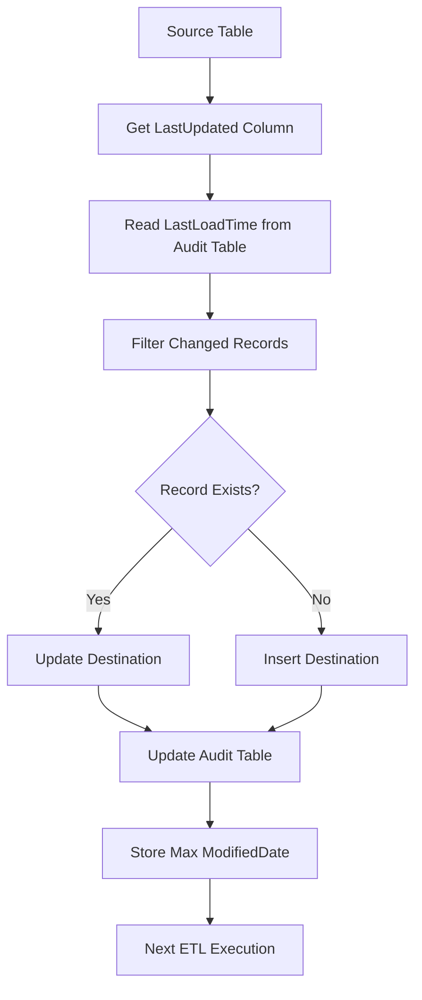

# Incremental Data Loading using LastUpdated/ModifiedDate

## Executive Summary

To implement an **Incremental ETL Process** that loads only **new and modified records** from the source system to the destination system using **LastUpdated/ModifiedDateTime** fields instead of loading the entire table every time. 

### Key Points

* **Incremental Loading** transfers only changed records, significantly improving ETL performance and reducing execution time. 
* **LastUpdated/ModifiedDate** acts as a watermark to identify newly inserted or modified records since the previous successful load. 
* **Audit and Metadata tables** store the last successful load time, execution status, and record counts to maintain ETL history and enable restartability. 
* **Insert and Update logic** ensures new records are inserted while existing records are updated without creating duplicates. 
* **Indexes, transformations, mappings, and proper SQL filtering** improve scalability and maintain data consistency across source and destination systems. 

---

# Enterprise Architecture

```text
                    +----------------------+
                    |   Source Database    |
                    | Customer, Email etc  |
                    +----------------------+
                               |
                               |
                               v
                   Read ModifiedDate Column
                               |
                               |
                               v
                  +--------------------------+
                  | Audit/Metadata Table     |
                  | Last Successful LoadTime |
                  +--------------------------+
                               |
                               |
                               v
        WHERE ModifiedDate > LastLoadDate
                               |
                               |
                               v
                  +--------------------------+
                  |   Changed Records        |
                  +--------------------------+
                               |
                   +-----------+------------+
                   |                        |
                   |                        |
             Existing Record?          New Record?
                   |                        |
                UPDATE                   INSERT
                   |                        |
                   +------------+-----------+
                                |
                                |
                                v
                     Destination Database
                                |
                                |
                                v
                   Update Audit Table
                                |
                                |
                                v
                    Next Incremental Load
```

---

# Mermaid Diagram



---

# Complete ETL Flow

```
Source
   │
   │
   ▼
Read LastUpdated
   │
   ▼
Get Last Load Timestamp
   │
   ▼
Filter Modified Records
   │
   ▼
Lookup Business Key
   │
   ├───────────────┐
   │               │
   ▼               ▼
Update          Insert
   │               │
   └──────┬────────┘
          │
          ▼
Destination Table
          │
          ▼
Audit Table Updated
          │
          ▼
Next Incremental Run
```

---

# SSIS Variables

| Variable              | Data Type | Value                |
| --------------------- | --------- | -------------------- |
| User::LastLoadDate    | DateTime  | NULL                 |
| User::CurrentLoadDate | DateTime  | GETDATE()            |
| User::SourceQuery     | String    | Dynamic SQL          |
| User::RowsInserted    | Int32     | 0                    |
| User::RowsUpdated     | Int32     | 0                    |
| User::PackageName     | String    | IncrementalLoad.dtsx |
| User::Status          | String    | Success              |
| User::ExecutionID     | Int32     | 1                    |

---

# SSIS Parameters

| Parameter                   | Data Type | Description        |
| --------------------------- | --------- | ------------------ |
| $Project::SourceServer      | String    | Source SQL Server  |
| $Project::DestinationServer | String    | Destination Server |
| $Project::DatabaseName      | String    | Database           |
| $Project::BatchSize         | Int32     | 10000              |
| $Project::LoadType          | String    | Incremental        |
| $Project::TableName         | String    | Customer           |

---

# Metadata Table

```sql
CREATE TABLE ETL_Metadata
(
TableName VARCHAR(100),
LastLoadDate DATETIME,
Status VARCHAR(20),
LastExecutionTime DATETIME
)
```

Sample Data

| TableName | LastLoadDate        |
| --------- | ------------------- |
| Customer  | 2026-06-20 10:00:00 |

---

# Audit Table

```sql
CREATE TABLE ETL_Audit
(
AuditID INT IDENTITY,
PackageName VARCHAR(100),
StartTime DATETIME,
EndTime DATETIME,
RowsInserted INT,
RowsUpdated INT,
Status VARCHAR(20),
ErrorMessage VARCHAR(1000)
)
```

---

# Step 1: Get Last Load Date

```sql
SELECT LastLoadDate
FROM ETL_Metadata
WHERE TableName='Customer'
```

Store result into

```
User::LastLoadDate
```

---

# Step 2: Read Incremental Records

```sql
SELECT
CustomerID,
CustomerName,
Email,
ModifiedDate
FROM CustomerSource
WHERE ModifiedDate >
?
```

Parameter Mapping

```
Parameter 0

Variable

User::LastLoadDate
```

---

# Dynamic SQL

```sql
DECLARE @LastLoadDate DATETIME

SELECT @LastLoadDate=LastLoadDate
FROM ETL_Metadata
WHERE TableName='Customer'

SELECT *
FROM CustomerSource
WHERE ModifiedDate>@LastLoadDate
```

---

# Lookup Logic

```
Source CustomerID

       |

       ▼

Destination CustomerID Exists?

       |

   +---+---+

   |       |

 Yes       No

   |        |

Update   Insert
```

---

# Update SQL

```sql
UPDATE D

SET

D.CustomerName=S.CustomerName,
D.Email=S.Email,
D.ModifiedDate=S.ModifiedDate

FROM CustomerDestination D

INNER JOIN CustomerStage S

ON D.CustomerID=S.CustomerID
```

---

# Insert SQL

```sql
INSERT INTO CustomerDestination
(
CustomerID,
CustomerName,
Email,
ModifiedDate
)

SELECT

CustomerID,
CustomerName,
Email,
ModifiedDate

FROM CustomerStage S

WHERE NOT EXISTS

(

SELECT 1

FROM CustomerDestination D

WHERE D.CustomerID=S.CustomerID

)
```

---

# Merge Statement (Real Time)

```sql
MERGE CustomerDestination AS TARGET

USING CustomerStage AS SOURCE

ON TARGET.CustomerID=SOURCE.CustomerID

WHEN MATCHED THEN

UPDATE SET

CustomerName=SOURCE.CustomerName,

Email=SOURCE.Email,

ModifiedDate=SOURCE.ModifiedDate

WHEN NOT MATCHED THEN

INSERT

(

CustomerID,

CustomerName,

Email,

ModifiedDate

)

VALUES

(

SOURCE.CustomerID,

SOURCE.CustomerName,

SOURCE.Email,

SOURCE.ModifiedDate

);
```

---

# Update Metadata Table

```sql
UPDATE ETL_Metadata

SET LastLoadDate=

(

SELECT MAX(ModifiedDate)

FROM CustomerSource

),

Status='Success',

LastExecutionTime=GETDATE()

WHERE TableName='Customer'
```

---

# Audit Insert

```sql
INSERT INTO ETL_Audit

(

PackageName,

StartTime,

EndTime,

RowsInserted,

RowsUpdated,

Status

)

VALUES

(

'IncrementalLoad.dtsx',

GETDATE(),

GETDATE(),

1500,

250,

'Success'

)
```

---

# Complete SSIS Package

```
+--------------------------------------------------+

Execute SQL Task
(Get Last Load Date)

|

v

Data Flow Task

|

+-------------------------------------------+

| OLE DB Source                             |

| WHERE ModifiedDate > LastLoadDate         |

+-------------------------------------------+

|

v

Lookup Transformation

|

+---------------------+

| Exists?             |

+---------------------+

|                     |

v                     v

OLE DB Cmd       OLE DB Destination

(Update)             (Insert)

|

v

Execute SQL Task

(Update Metadata)

|

v

Execute SQL Task

(Insert Audit Log)

|

v

Package Success
```

---

# Overall Enterprise Workflow

```text
                    Source Database
                           │
                           ▼
                Read ModifiedDate Column
                           │
                           ▼
             Get LastLoadDate From Metadata
                           │
                           ▼
          Filter Changed Records Only
                           │
                           ▼
                 Lookup Business Key
                           │
          ┌────────────────┴───────────────┐
          │                                │
          ▼                                ▼
     Existing Record                  New Record
          │                                │
          ▼                                ▼
       UPDATE                           INSERT
          │                                │
          └───────────────┬────────────────┘
                          ▼
                  Destination Table
                          │
                          ▼
                  Update Metadata
                          │
                          ▼
                  Insert Audit Log
                          │
                          ▼
                  Next Incremental Load
```


For **Execute SQL Task** in SSIS, the **Connection Type** should be **OLE DB**, and the provider should match your SQL Server version.

## For SQL Server 2019 (Recommended)

✅ **Native OLE DB\Microsoft OLE DB Provider for SQL Server**

---

## Connection Manager

| Setting        | Value                                                      |
| -------------- | ---------------------------------------------------------- |
| Provider       | **Native OLE DB\Microsoft OLE DB Provider for SQL Server** |
| Server Name    | `NirmalaPrakash`                                           |
| Authentication | Windows Authentication                                     |
| Database       | `DataWarehouse`                                            |

Click **Test Connection** → **OK**


---

# Execute SQL Task Settings

### General

| Property       | Value                                               |
| -------------- | --------------------------------------------------- |
| ConnectionType | OLE DB                                              |
| Connection     | DataWarehouse Connection Manager                    |
| SQLSourceType  | Direct Input                                        |
| ResultSet      | None (for INSERT/UPDATE) or Single Row (for SELECT) |

---

# If Running SELECT Query

Example:

```sql
SELECT DATEADD(SECOND,1,LastUpdatedValue)
FROM config_table
WHERE TableName='[Person].[EmailAddress]'
```

### ResultSet

```
Single Row
```

### Result Set Tab

| Result Name | Variable               |
| ----------- | ---------------------- |
| 0           | User::LastUpdatedValue |

---

# If Running INSERT Query

```sql
INSERT INTO audit_log
(
    PackageName,
    TableName,
    RecordsInserted,
    RecordsUpdated,
    StartTime
)
VALUES
(
    ?, ?, ?, ?, GETDATE()
)
```

### ResultSet

```
None
```

### Parameter Mapping

| Variable              | Data Type | Parameter Name |
| --------------------- | --------- | -------------- |
| User::PackageName     | VARCHAR   | 0              |
| User::TableName       | VARCHAR   | 1              |
| User::RecordsInserted | LONG      | 2              |
| User::RecordsUpdated  | LONG      | 3              |

---

# If Running UPDATE Query

```sql
UPDATE config_table
SET LastUpdatedValue =
(
    SELECT MAX(ModifiedDate)
    FROM Person.EmailAddress
)
WHERE TableName='[Person].[EmailAddress]'
```

### ResultSet

```
None
```

No parameter mapping is required if there are no `?` placeholders.

---

# Common Providers

| Provider                                                   | Recommendation               |
| ---------------------------------------------------------- | ---------------------------- |
| **Native OLE DB\Microsoft OLE DB Provider for SQL Server** | ⭐⭐⭐⭐⭐ Recommended            |
| SQL Server Native Client 11.0                              | Supported but older          |
| .NET Providers\SqlClient Data Provider                     | Use only for ADO.NET tasks   |
| ODBC Driver                                                | Use only if ODBC is required |

---

## For Your Incremental Load Project

Use the **same OLE DB Connection Manager (`DataWarehouse`)** for:

* ✅ Execute SQL Task (Get LastUpdatedValue)
* ✅ Execute SQL Task (Insert Audit Log)
* ✅ Execute SQL Task (Update Config Table)
* ✅ OLE DB Destination
* ✅ Lookup Transformation (Destination Table)

