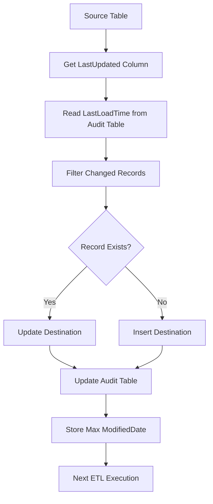

# Incremental Data Loading using LastUpdated/ModifiedDate

## Executive Summary

To implement an **Incremental ETL Process** that loads only **new and modified records** from the source system to the destination system using **LastUpdated/ModifiedDateTime** fields instead of loading the entire table every time. 

### Key Points

* **Incremental Loading** transfers only changed records, significantly improving ETL performance and reducing execution time. 
* **LastUpdated/ModifiedDate** acts as a watermark to identify newly inserted or modified records since the previous successful load. 
* **Audit and Metadata tables** store the last successful load time, execution status, and record counts to maintain ETL history and enable restartability. 
* **Insert and Update logic** ensures new records are inserted while existing records are updated without creating duplicates. 
* **Indexes, transformations, mappings, and proper SQL filtering** improve scalability and maintain data consistency across source and destination systems. 

---

# Enterprise Architecture

```text
                    +----------------------+
                    |   Source Database    |
                    | Customer, Email etc  |
                    +----------------------+
                               |
                               |
                               v
                   Read ModifiedDate Column
                               |
                               |
                               v
                  +--------------------------+
                  | Audit/Metadata Table     |
                  | Last Successful LoadTime |
                  +--------------------------+
                               |
                               |
                               v
        WHERE ModifiedDate > LastLoadDate
                               |
                               |
                               v
                  +--------------------------+
                  |   Changed Records        |
                  +--------------------------+
                               |
                   +-----------+------------+
                   |                        |
                   |                        |
             Existing Record?          New Record?
                   |                        |
                UPDATE                   INSERT
                   |                        |
                   +------------+-----------+
                                |
                                |
                                v
                     Destination Database
                                |
                                |
                                v
                   Update Audit Table
                                |
                                |
                                v
                    Next Incremental Load
```

---

# Mermaid Diagram



---

---

# Overall Enterprise Workflow

```text
                    Source Database
                           │
                           ▼
                Read ModifiedDate Column
                           │
                           ▼
             Get LastLoadDate From Metadata
                           │
                           ▼
          Filter Changed Records Only
                           │
                           ▼
                 Lookup Business Key
                           │
          ┌────────────────┴───────────────┐
          │                                │
          ▼                                ▼
     Existing Record                  New Record
          │                                │
          ▼                                ▼
       UPDATE                           INSERT
          │                                │
          └───────────────┬────────────────┘
                          ▼
                  Destination Table
                          │
                          ▼
                  Update Metadata
                          │
                          ▼
                  Insert Audit Log
                          │
                          ▼
                  Next Incremental Load
```


For **Execute SQL Task** in SSIS, the **Connection Type** should be **OLE DB**, and the provider should match your SQL Server version.

## For SQL Server 2019 (Recommended)

✅ **Native OLE DB\Microsoft OLE DB Provider for SQL Server**

---

## Connection Manager

| Setting        | Value                                                      |
| -------------- | ---------------------------------------------------------- |
| Provider       | **Native OLE DB\Microsoft OLE DB Provider for SQL Server** |
| Server Name    | `NirmalaPrakash`                                           |
| Authentication | Windows Authentication                                     |
| Database       | `DataWarehouse`                                            |

Click **Test Connection** → **OK**


---

# Execute SQL Task Settings

### General

| Property       | Value                                               |
| -------------- | --------------------------------------------------- |
| ConnectionType | OLE DB                                              |
| Connection     | DataWarehouse Connection Manager                    |
| SQLSourceType  | Direct Input                                        |
| ResultSet      | None (for INSERT/UPDATE) or Single Row (for SELECT) |

---


---

# Common Providers

| Provider                                                   | Recommendation               |
| ---------------------------------------------------------- | ---------------------------- |
| **Native OLE DB\Microsoft OLE DB Provider for SQL Server** | ⭐⭐⭐⭐⭐ Recommended            |
| SQL Server Native Client 11.0                              | Supported but older          |
| .NET Providers\SqlClient Data Provider                     | Use only for ADO.NET tasks   |
| ODBC Driver                                                | Use only if ODBC is required |

---


