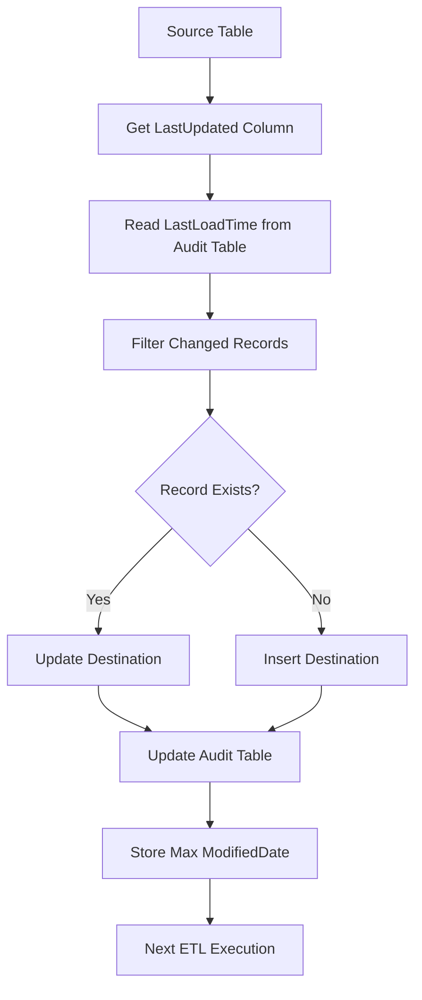

# Incremental Data Loading using LastUpdated/ModifiedDate

## Executive Summary

To implement an **Incremental ETL Process** that loads only **new and modified records** from the source system to the destination system using **LastUpdated/ModifiedDateTime** fields instead of loading the entire table every time. 

### Key Points

* **Incremental Loading** transfers only changed records, significantly improving ETL performance and reducing execution time. 
* **LastUpdated/ModifiedDate** acts as a watermark to identify newly inserted or modified records since the previous successful load. 
* **Audit and Metadata tables** store the last successful load time, execution status, and record counts to maintain ETL history and enable restartability. 
* **Insert and Update logic** ensures new records are inserted while existing records are updated without creating duplicates. 
* **Indexes, transformations, mappings, and proper SQL filtering** improve scalability and maintain data consistency across source and destination systems. 

---

# Enterprise Architecture

```text
                    +----------------------+
                    |   Source Database    |
                    | Customer, Email etc  |
                    +----------------------+
                               |
                               |
                               v
                   Read ModifiedDate Column
                               |
                               |
                               v
                  +--------------------------+
                  | Audit/Metadata Table     |
                  | Last Successful LoadTime |
                  +--------------------------+
                               |
                               |
                               v
                 WHERE ModifiedDate > LastLoadDate
                               |
                               |
                               v
                  +--------------------------+
                  |   Changed Records        |
                  +--------------------------+
                               |
                   +-----------+------------+
                   |                        |
                   |                        |
             Existing Record?          New Record?
                   |                        |
                UPDATE                   INSERT
                   |                        |
                   +------------+-----------+
                                |
                                |
                                v
                     Destination Database
                                |
                                |
                                v
                   Update Audit Table
                                |
                                |
                                v
                    Next Incremental Load
```

---

# Mermaid Diagram



---

---

# Overall Enterprise Workflow

```text
                    Source Database
                           │
                           ▼
                Read ModifiedDate Column
                           │
                           ▼
             Get LastLoadDate From Metadata
                           │
                           ▼
              Filter Changed Records Only
                           │
                           ▼
                 Lookup Business Key
                           │
          ┌────────────────┴───────────────┐
          │                                │
          ▼                                ▼
     Existing Record                  New Record
          │                                │
          ▼                                ▼
       UPDATE                           INSERT
          │                                │
          └───────────────┬────────────────┘
                          ▼
                  Destination Table
                          │
                          ▼
                  Update Metadata
                          │
                          ▼
                  Insert Audit Log
                          │
                          ▼
                  Next Incremental Load
```

## For SQL Server 2019 (Recommended)

✅ **Native OLE DB\Microsoft OLE DB Provider for SQL Server**

For **Execute SQL Task** in SSIS, the **Connection Type** should be **OLE DB**, and the provider should match your SQL Server version.
---

## Connection Manager

| Setting        | Value                                                      |
| -------------- | ---------------------------------------------------------- |
| Provider       | **Native OLE DB\Microsoft OLE DB Provider for SQL Server** |
| Server Name    | `NirmalaPrakash`                                           |
| Authentication | Windows Authentication                                     |
| Database       | `DataWarehouse`                                            |

Click **Test Connection** → **OK**


---

# Execute SQL Task Settings

### General

| Property       | Value                                               |
| -------------- | --------------------------------------------------- |
| ConnectionType | OLE DB                                              |
| Connection     | DataWarehouse Connection Manager                    |
| SQLSourceType  | Direct Input                                        |
| ResultSet      | None (for INSERT/UPDATE) or Single Row (for SELECT) |

---

---

# Common Providers

| Provider                                                   | Recommendation               |
| ---------------------------------------------------------- | ---------------------------- |
| **Native OLE DB\Microsoft OLE DB Provider for SQL Server** | ⭐⭐⭐⭐⭐ Recommended            |
| SQL Server Native Client 11.0                              | Supported but older          |
| .NET Providers\SqlClient Data Provider                     | Use only for ADO.NET tasks   |
| ODBC Driver                                                | Use only if ODBC is required |

---
# Enterprise Incremental ETL Project (AdventureWorks2019 → DataWarehouse)

This is the **recommended real-time enterprise solution** for SQL Server + SSIS.

---

# Architecture

```text
AdventureWorks2019
        │
        │
Execute SQL Task
(Get LastUpdatedValue)
        │
        ▼
OLE DB Source
(ModifiedDate > LastUpdatedValue)
        │
        ▼
Stage_EmailAddress
        │
        ▼
Execute SQL Task (MERGE)
        │
        ├──────────────► EmailAddress
        │
        ├──────────────► audit_log
        │
        ├──────────────► config_table
        │
        └──────────────► TRUNCATE Stage_EmailAddress
```

---

# Step 1 : Create DataWarehouse

```sql
CREATE DATABASE DataWarehouse;
GO

USE DataWarehouse;
GO
```

---

# Step 2 : Create Destination Table

```sql
CREATE TABLE dbo.EmailAddress
(
    BusinessEntityID INT,
    EmailAddressID INT PRIMARY KEY,
    EmailAddress NVARCHAR(50),
    rowguid UNIQUEIDENTIFIER,
    ModifiedDate DATETIME
);
```

---

# Step 3 : Create Stage Table

```sql
CREATE TABLE dbo.Stage_EmailAddress
(
    BusinessEntityID INT,
    EmailAddressID INT,
    EmailAddress NVARCHAR(50),
    rowguid UNIQUEIDENTIFIER,
    ModifiedDate DATETIME
);
```

---

# Step 4 : Create Audit Table

```sql
CREATE TABLE audit_log
(
    Id INT IDENTITY PRIMARY KEY,
    PackageName VARCHAR(200),
    TableName VARCHAR(200),
    RecordsInserted INT,
    RecordsUpdated INT,
    RecordsDeleted INT,
    StartTime DATETIME,
    EndTime DATETIME,
    Status VARCHAR(20),
    ErrorMessage VARCHAR(1000),
    Dated DATETIME DEFAULT GETDATE()
);
```

---

# Step 5 : Create Config Table

```sql
CREATE TABLE config_table
(
    Id INT IDENTITY PRIMARY KEY,
    TableName VARCHAR(200),
    LastUpdatedColumn VARCHAR(100),
    LastUpdatedValue DATETIME
);

INSERT INTO config_table 
VALUES ('EmailAddress', 'ModifiedDate', '1900-01-01');
```

---

# Step 6 : Trigger (Most Important)

Whenever any business column changes, ModifiedDate should update automatically.

```sql
CREATE TRIGGER TR_EmailAddress_ModifiedDate
ON Person.EmailAddress
AFTER UPDATE
AS
BEGIN

SET NOCOUNT ON;

UPDATE E
SET ModifiedDate=GETDATE()
FROM Person.EmailAddress E
INNER JOIN inserted I
ON E.EmailAddressID=I.EmailAddressID;

END;
```

---

# Step 7 : SSIS Variables

| Variable               | Datatype |
| ---------------------- | -------- |
| User::LastUpdatedValue | DateTime |
| User::RecordsInserted  | Int32    |

---

# Step 8 : Control Flow

```
Execute SQL Task
(Get LastUpdatedValue)
↓
Data Flow Task
↓
Execute SQL Task
(MERGE + Audit + Config)
```

---

# Step 9 : Execute SQL Task

### SQL

```sql
SELECT LastUpdatedValue
FROM config_table
WHERE TableName ='EmailAddress'
```

### Properties

```
ConnectionType = OLE DB

SQLSourceType = Direct Input

ResultSet = Single Row
```

### Result Set

| Result Name | Variable               |
| ----------- | ---------------------- |
| 0           | User::LastUpdatedValue |

---

# Step 10 : Data Flow

```
OLE DB Source
↓
OLE DB Destination : Stage_EmailAddress
```

---

# Step 11 : OLE DB Source


```sql
SELECT BusinessEntityID, EmailAddressID, EmailAddress, rowguid, ModifiedDate 
FROM Person.EmailAddress
WHERE ModifiedDate > ?
```

Parameter Mapping

| Parameter | Variable               |
| --------- | ---------------------- |
| 0         | User::LastUpdatedValue |

---

# Step 12 : OLE DB Destination

```
Destination: Stage_EmailAddress
Data Access Mode: Table or View Fast Load
```

---

# Step 13 : MERGE

```sql
DECLARE @Audit TABLE (ActionType VARCHAR(20));

MERGE dbo.EmailAddress AS Target
USING dbo.Stage_EmailAddress AS Source
ON Target.EmailAddressID=Source.EmailAddressID
WHEN MATCHED
AND
(
ISNULL(Target.EmailAddress,'') <> ISNULL(Source.EmailAddress,'')
OR
ISNULL(Target.ModifiedDate,'1900-01-01') <> ISNULL(Source.ModifiedDate,'1900-01-01')
)

THEN UPDATE SET
Target.BusinessEntityID = Source.BusinessEntityID,
Target.EmailAddress = Source.EmailAddress,
Target.rowguid = Source.rowguid,
Target.ModifiedDate = Source.ModifiedDate

WHEN NOT MATCHED
THEN INSERT (BusinessEntityID, EmailAddressID, EmailAddress, rowguid, ModifiedDate) 
VALUES ( Source.BusinessEntityID, Source.EmailAddressID, Source.EmailAddress, Source.rowguid, Source.ModifiedDate)
OUTPUT $action INTO @Audit;
```

---

# Step 14 : Audit Log

```sql
DECLARE @Inserted INT;
DECLARE @Updated INT;

SELECT
@Inserted=COUNT(*)
FROM @Audit
WHERE ActionType='INSERT';
SELECT
@Updated=COUNT(*)
FROM @Audit
WHERE ActionType='UPDATE';

INSERT INTO audit_log (PackageName, TableName, RecordsInserted, RecordsUpdated, RecordsDeleted, StartTime, EndTime, Status)
VALUES ( 'IncrementalLoad.dtsx', 'EmailAddress', @Inserted, @Updated, 0, GETDATE(), GETDATE(), 'Success' );
```

---

# Step 15 : Update Watermark

```sql
UPDATE config_table
SET LastUpdatedValue = (SELECT MAX(ModifiedDate) FROM dbo.EmailAddress)
WHERE TableName='EmailAddress';
```

---

# Step 16 : Clear Stage Table

```sql
TRUNCATE TABLE Stage_EmailAddress;
```

---

# First Run


```
Source: 19972 rows
↓
Stage: 19972 rows
↓
MERGE
Inserted = 19972
Updated = 0
↓
audit_log: 19972 Inserted
↓
config_table
LastUpdatedValue updated
↓
Stage truncated
```

---

# Second Run (No Changes)

```
Source: 0 rows
↓
Stage: 0 rows
↓
MERGE
Inserted=0
Updated=0
↓
audit_log: 0
↓
config_table unchanged
```

---

# Third Run

User executes

```sql
UPDATE Person.EmailAddress
SET
EmailAddress='new@gmail.com'
WHERE EmailAddressID=10;
```

Trigger automatically executes

```sql
ModifiedDate=GETDATE()
```

Result

```
Source: 1 changed row
↓
Stage: 1 row
↓
MERGE
MATCHED
↓
UPDATE
↓
audit_log
Inserted=0
Updated=1
↓
config_table updated
↓
Stage truncated
```

---

# Final Flow

```
AdventureWorks2019
↓
Trigger updates ModifiedDate automatically
↓
SSIS reads LastUpdatedValue
↓
OLE DB Source
WHERE ModifiedDate > LastUpdatedValue
↓
Stage_EmailAddress
↓
MERGE
├── Insert New Records
├── Update Existing Records
↓
audit_log
↓
config_table
↓
TRUNCATE Stage_EmailAddress
```

# Why this is Enterprise Standard

* ✅ No duplicate records
* ✅ New records inserted automatically
* ✅ Updated records updated automatically
* ✅ Trigger guarantees every business change updates `ModifiedDate`
* ✅ MERGE performs UPSERT in a single statement
* ✅ Audit log captures inserted/updated counts
* ✅ Config table stores the watermark for the next run
* ✅ Stage table is cleared after successful processing
* ✅ Restartable, scalable, and suitable for production ETL pipelines

